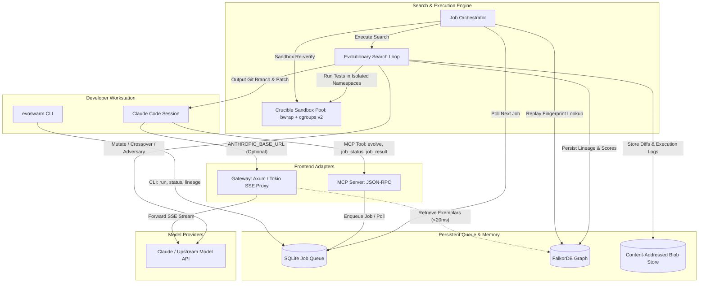
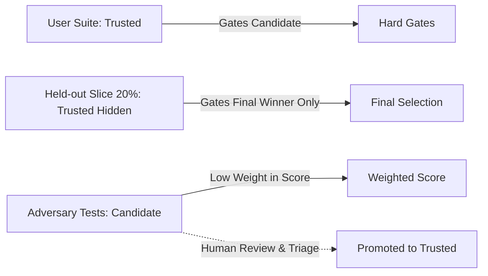

# EvoSwarm: Evolutionary Code Swarm

> **Self-hosted evolutionary code synthesis with persistent graph memory, sealed bubblewrap sandboxes, and native Claude Code MCP integration.**

---

## 1. Executive Summary

**EvoSwarm** is an autonomous, self-hosted Rust service that evolves code against automated test suites and remembers what worked. When delegated an engineering task by Claude Code or the CLI:

1. **System 2 (Evolutionary Search Loop):** Breeds candidate patches using specialized LLM roles (`mutator`, `synthesiser`, `adversary`), validates them inside sealed bubblewrap (`bwrap`) namespaces with cgroup v2 resource limits (**The Crucible**), and emits verified patches backed by lineage and execution evidence.
2. **System 1 (FalkorDB Graph Memory):** Records winning candidates, ancestral lineage, and the attacks they survived. Replay requests matching triple fingerprints (spec hash, repository fingerprint, and toolchain fingerprint) are re-verified in seconds with **zero model spend**.
3. **Optional Streaming Gateway:** A transparent Tokio/Axum reverse proxy that intercepts Claude Code traffic, logs token and dollar spend, and enriches prompts with verified past exemplars without adding time-to-first-token latency.

EvoSwarm targets a single headless Linux machine (including repurposed 2012-era hardware with 16 GB RAM) with **no VMs or container daemons required**.

---

## 2. Architecture Overview



### Core Components

- **The Crucible (`SandboxBackend`):** Executes untrusted code inside isolated `bwrap` namespaces with no network access (`--unshare-all`), read-only toolchain mounts, and host cgroups v2 enforcement (`systemd-run --user`).
- **Orchestrator & Search Loop:** Enforces token and dollar budgets, seeds population from prior winners, executes hard gating, and drives mutation and crossover recombination.
- **System 1 Memory:** Dual-store architecture pairing FalkorDB (graph lineage, scores, vector index) with an immutable, content-addressed disk blob store (`.evoswarm/blobs/`).
- **Claude Code MCP Server:** Exposes `evolve`, `job_status`, `job_result`, and `cancel_job` tools.
- **Axum Streaming Gateway:** Low-overhead reverse proxy providing token auditing and bounded memory exemplar injection.

---

## 3. Operating Modes

| Mode | Trigger | Latency Target | Description |
|---|---|---|---|
| **Gateway (Optional)** | `ANTHROPIC_BASE_URL` points to EvoSwarm | Adds $< 50$ ms to TTFT | Streams SSE byte-for-byte; audits token usage; injects retrieved exemplars if memory lookup completes in $< 20$ ms. |
| **Evolve Job** | `evolve` MCP tool call or `evoswarm run` CLI | Minutes (budgeted) | Runs multi-generation evolutionary loop against target tests; returns patch branch, `.patch` file, and audit report. |
| **Replay** | Matching spec hash + repo fingerprint + toolchain fingerprint | Seconds | Re-runs stored winning patch in the Crucible sandbox; returns immediately if tests pass with 0 LLM calls. |

---

## 4. Fitness Function & Test Provenance

Candidate solutions are evaluated through a strict **gate-first** pipeline followed by a multi-objective weighted score.

### Test Provenance



### The Hard Gates (Fail Any $\rightarrow$ Score = 0)
1. **Clean Build:** Builds with zero compiler errors.
2. **Trusted Tests Pass:** 100% of visible trusted tests pass.
3. **Zero Tampering:** Diff touches no test files, harnesses (`conftest.py`, `.props`), or build scripts. Tests run from read-only mounts.
4. **Zero Skips:** No test skipped, ignored, or deleted relative to baseline.

### Multi-Objective Score

For candidates passing all gates:

$$S = w_a \cdot A + w_p \cdot P + w_s \cdot Z$$

- $w_a = 0.5$: Pass rate on candidate adversary tests ($A \in [0, 1]$).
- $w_p = 0.3$: Runtime performance relative to baseline ($P \in [0, 1]$).
- $w_s = 0.2$: Parsimony score rewarding concise diffs ($Z \in [0, 1]$).

---

## 5. Hardware & Capacity Budget (2012-Era Box)

Targeting an Intel 4-Core / 8-Thread CPU with 16 GB RAM and an SSD:

| Subsystem | RAM Allocation | Role |
|---|---|---|
| OS, systemd, SSH | 2.0 GB | Host OS & system daemons |
| FalkorDB | 1.5 GB | In-memory graph lineage & indices |
| Orchestrator & Gateway | 0.5 GB | Rust Tokio runtimes & SQLite |
| Host `tmpfs` Workdirs | 1.0 GB | Ephemeral candidate build directories |
| Crucible Sandbox Pool | ~11.0 GB | 3 concurrent C#/Java workers or 6 Python workers |

---

## 6. Project Roadmap & Epics

The project follows a phased roadmap where each phase delivers an independently verifiable capability:

| Epic | Specification Document | Exit Gate Criteria |
|---|---|---|
| **Epic 0: The Crucible** | [docs/epics/epic-0-the-crucible.md](docs/epics/epic-0-the-crucible.md) | 100 baseline runs with 0 escapes; network and fork-bomb contained; limits calibrated. |
| **Epic 1: Evolve CLI & Fitness** | [docs/epics/epic-1-evolve-cli-and-fitness.md](docs/epics/epic-1-evolve-cli-and-fitness.md) | **Beats single-shot generation by $\ge 15$ points** on 30-task benchmark at equal token budget. |
| **Epic 2: System 1 Memory & Replay** | [docs/epics/epic-2-system-1-memory-and-replay.md](docs/epics/epic-2-system-1-memory-and-replay.md) | Replay never serves a stale winner; seeding cuts token spend by $\ge 30\%$. |
| **Epic 3: Claude Code Integration** | [docs/epics/epic-3-claude-code-integration-mcp.md](docs/epics/epic-3-claude-code-integration-mcp.md) | Claude Code delegates task via `evolve`, fetches patch, and verifies locally with 0 intervention. |
| **Epic 4: Optional Streaming Gateway** | [docs/epics/epic-4-optional-gateway.md](docs/epics/epic-4-optional-gateway.md) | Adds $< 50$ ms TTFT at p95 under 20 concurrent streams with byte-for-byte fidelity. |
| **Epic 5: MAP-Elites & More Stacks** | [docs/epics/epic-5-map-elites-and-more-stacks.md](docs/epics/epic-5-map-elites-and-more-stacks.md) | $4 \times 4$ archive matches/beats Top-K; Java and C/C++ pass red-team containment. |

---

## 7. Repository Organization

```
.
├── .agents/
│   ├── rules/                       # Universal engineering & architectural rules
│   │   ├── architecture-rules.md    # Architectural invariants & divergence criteria
│   │   ├── lessons-learned.md       # Anti-cheat rules, YAML preservation, bug preventions
│   │   ├── security-hygiene.md      # Secret protection & subprocess safety
│   │   └── tdd-discipline.md        # Strict Red-Green-Refactor standards
│   └── skills/                      # Specialized agent runbooks (grill-me, build, decompose, etc.)
├── docs/
│   ├── prd/
│   │   └── evoswarm-prd.md          # Canonical Product Requirements Document
│   ├── architecture/
│   │   └── ARCHITECTURE-SPINE.md    # Architectural decisions (ADRs) & contracts
│   ├── epics/                       # Epic specifications (Epic 0 through 5)
│   │   ├── epic-0-the-crucible.md
│   │   ├── epic-1-evolve-cli-and-fitness.md
│   │   ├── epic-2-system-1-memory-and-replay.md
│   │   ├── epic-3-claude-code-integration-mcp.md
│   │   ├── epic-4-optional-gateway.md
│   │   └── epic-5-map-elites-and-more-stacks.md
│   └── stories/                     # 47 Detailed vertical-slice user stories (e0-1 to e5-6)
├── scripts/
│   ├── sprint.py                    # Deterministic sprint ledger, verification gate & dispatch CLI
│   ├── dispatch.py                  # Model-agnostic context compiler & multi-provider client
│   └── generate_stories.py          # Story artifact generator
├── sprint-status.yaml               # Active sprint progress ledger
├── AGENTS.md                        # Agent personas & orchestration guidelines
└── GEMINI.md                        # Gemini model instructions & clickable links standard
```

---

## 8. Sprint Orchestration & Development Workflow

This repository uses deterministic sprint management driven by `scripts/sprint.py` and strict Kent Beck TDD discipline:

### 1. Inspect Sprint Progress
```bash
python3 scripts/sprint.py status
```

### 2. Fetch the Next Actionable Story
```bash
python3 scripts/sprint.py next
# Output:
# NEXT_STORY=e0-1-sandbox-runner-interface
# TIER=flash
```

### 3. Dispatch to Subagent or Begin TDD
```bash
python3 scripts/sprint.py dispatch e0-1-sandbox-runner-interface --persona developer
```

### 4. TDD Red-Green-Refactor Cycle
1. **Red:** Write failing tests first.
2. **Verify Failure:** Run verification gate:
   ```bash
   python3 scripts/sprint.py verify --cmd "cargo test test_sandbox" --anti-cheat
   ```
3. **Green:** Author minimal production code to satisfy tests.
4. **Refactor:** Clean up code, remove duplication, ensure zero AI metadata comments.

### 5. Advance Sprint State
```bash
python3 scripts/sprint.py update e0-1-sandbox-runner-interface --status review
# Following adversarial review:
python3 scripts/sprint.py update e0-1-sandbox-runner-interface --status done
```

---

## 9. Security & Anti-Cheat Invariants

- **Test Immutability:** Tests are mounted read-only (`--ro-bind`) during evaluation. Tampering with assertions or harness overrides (`conftest.py`, `Directory.Build.props`) results in immediate failure.
- **Anti-Cheat Verification:** `scripts/sprint.py verify --anti-cheat` automatically inspects git diffs for deleted or weakened test assertions.
- **Secret Redaction:** Outgoing prompts are scanned against pattern allowlists; `.env` and `*.pem` files are strictly excluded.
