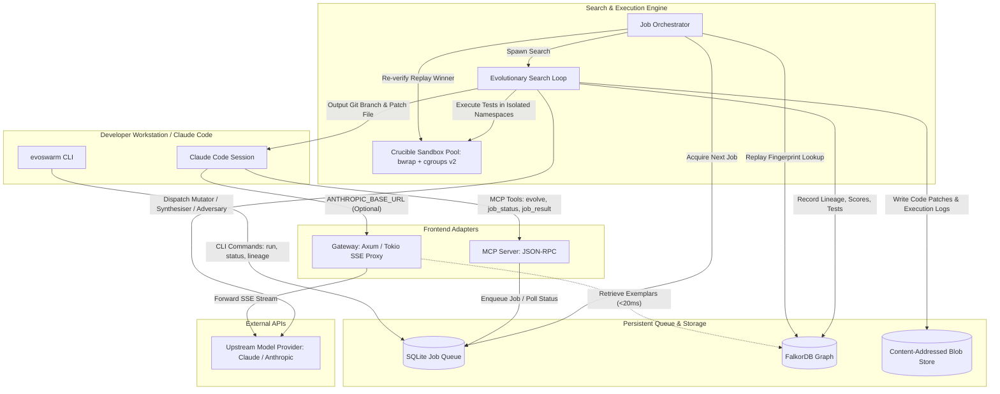
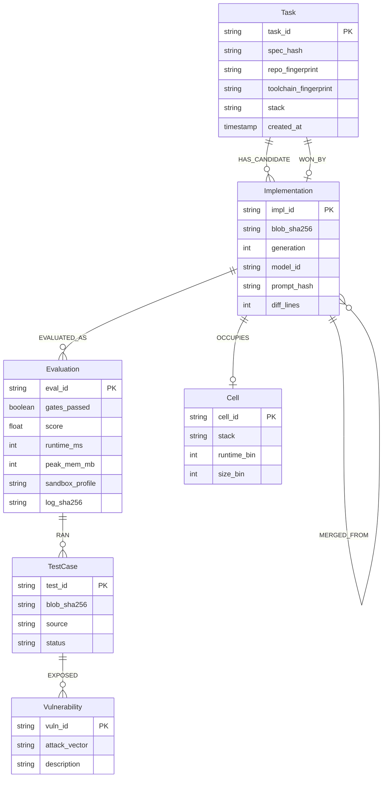

# EvoSwarm: Architecture Spine & System Invariants

## 1. System Vision & Architectural Boundaries

EvoSwarm is a self-hosted Rust service executing on a single headless Linux system. It couples an asynchronous, budgeted evolutionary code generation engine (**System 2**) with a graph-and-blob memory system (**System 1**), surfaced to developer workflows via an MCP tool suite, a CLI, and an optional transparent streaming reverse proxy (Gateway).

### System Topology



---

## 2. Architectural Invariants (The Divergence Contract)

The Divergence Test: *If two subagents built two parts of the system independently, could they make incompatible choices?*
The following Architecture Decisions (`AD-n`) fix all non-negotiable cross-module invariants.

### AD-1: The Crucible Sandbox Isolation Boundary
- **Status:** Adopted
- **Context:** Untrusted code drafted by LLMs can run arbitrary shell commands, attempt network egress, execute fork bombs, or tamper with test files. We cannot rely on Docker or daemon-heavy runtimes on legacy hardware.
- **Decision:** All candidate evaluations must execute through a stateless `SandboxBackend` leveraging unprivileged bubblewrap (`bwrap`) namespaces and Linux cgroups v2 (`systemd-run --user`).
- **Binds:**
  1. Network egress is forbidden: `--unshare-all` flag is mandatory.
  2. Test directories (`/work/tests`) and system toolchains (`/usr`, `/lib`, runtime caches) must be mounted strictly read-only (`--ro-bind`).
  3. The per-candidate working directory (`/work`) must reside on an ephemeral host `tmpfs` and be completely wiped on process termination.
  4. Memory limits (`MemoryMax`) and process counts (`TasksMax`) must be hard-capped via cgroup v2.
  5. Any attempt to write to read-only mounts or mutate test harnesses (e.g. creating `conftest.py` or `.props`) immediately aborts the candidate with gate status `tamper`.
- **Prevents:** Candidates passing by weakening test assertions, exfiltrating host secrets, or monopolizing host resources.

### AD-2: Decoupled Gateway and Swarm Asynchrony
- **Status:** Adopted
- **Context:** Claude Code streaming chat requires low-latency time-to-first-token (TTFT). Evolutionary searches take minutes.
- **Decision:** The streaming gateway and the evolutionary loop are strictly decoupled. The gateway is a transparent Tokio/Axum byte-for-byte SSE proxy that never blocks on swarm state.
- **Binds:**
  1. The Gateway may only query FalkorDB memory for system prompt exemplars with an unconditional hard timeout of 20 ms.
  2. If the memory query exceeds 20 ms or errors, the Gateway forwards the request unmodified.
  3. The Gateway never initiates or waits for an evolutionary job.
  4. Long-running code search is initiated exclusively through asynchronous MCP tool calls (`evolve`) or the CLI (`evoswarm run`), with jobs tracked in SQLite.
- **Prevents:** Client timeouts, IDE stalls, and cascading failure between real-time chat and background search.

### AD-3: Dual-Store Memory Architecture (Graph + Blob)
- **Status:** Adopted
- **Context:** EvoSwarm targets 2012-era hardware with 16 GB RAM (allocating at most 1.5 GB to FalkorDB). Storing entire source trees, diffs, and compiler logs directly in graph node properties would rapidly cause OOM crashes.
- **Decision:** Segregate graph topology from heavy payloads:
  1. **FalkorDB:** Stores node keys, lineage edges (`MUTATED_FROM`, `MERGED_FROM`), scalar scores, and test metadata.
  2. **Content-Addressed Blob Store:** On-disk storage (`.evoswarm/blobs/<sha256>`) stores raw file contents, diffs, build output, and JUnit test logs.
- **Binds:**
  1. Graph nodes reference code and logs exclusively via SHA-256 digests (`blob_sha256`).
  2. Blobs are immutable and content-addressed. Writing identical content twice yields a single on-disk object.
  3. Blob garbage collection operates via unreferenced sweep (7-day retention).
- **Prevents:** FalkorDB RAM exhaustion and unbounded graph database growth.

### AD-4: Deterministic Replay Invalidation
- **Status:** Adopted
- **Context:** Replaying a cached winner saves 100% of LLM spend. However, returning a patch that fails in the current repo state destroys user trust.
- **Decision:** Replay requires matching triple fingerprints: `spec_hash`, `repo_fingerprint`, and `toolchain_fingerprint`. Furthermore, a matched winner must re-pass its test suite in the Crucible sandbox before being returned.
- **Binds:**
  1. `spec_hash` is a SHA-256 of the prompt/task description and test command.
  2. `repo_fingerprint` is a SHA-256 of all files within the task's touched path allowlist, plus the package lockfile (`uv.lock`, `packages.lock.json`, etc.).
  3. `toolchain_fingerprint` is a SHA-256 of the compiler, runtime, and harness versions.
  4. Replay candidate execution is zero-model-cost but must execute in the sandbox. If tests fail, replay is aborted, marked stale, and falls back to seeding a new evolutionary search.
- **Prevents:** Serving stale, broken, or insecure code when environment dependencies or sibling files have shifted.

### AD-5: Strict Test Provenance and Gate Enforcement
- **Status:** Adopted
- **Context:** Candidates in evolutionary loops will exploit any leeway in fitness functions, including optimizing against unverified adversary-generated tests.
- **Decision:** Candidate fitness adheres to a strict two-stage gate-then-score pipeline with four test provenances:
  - **Trusted (User Suite):** Gating authority.
  - **Trusted Hidden (Held-out Slice ~20%):** Evaluated strictly on final candidate selection; never shown to mutators.
  - **Candidate (Adversary Tests):** Scored as an objective term ($w_a = 0.5$); cannot fail a gate.
  - **Promoted:** Candidate tests reviewed and approved by human operator in triage.
- **Binds:**
  1. Hard gates are evaluated in sequence: (1) Clean Build, (2) All Visible Trusted Tests Pass, (3) Zero Tampering, (4) Zero Skipped/Deleted Tests.
  2. Failure of any gate immediately assigns a composite score of 0.
  3. The final winner must pass the held-out test suite. If the highest-scoring candidate fails held-out tests, the runner evaluates the next highest candidate.
- **Prevents:** LLMs generating trivial tests to pass, overfitting to visible tests, or hacking harnesses.

### AD-6: Model Role Segregation & Budget Invariants
- **Status:** Adopted
- **Context:** High-capability models (e.g. DeepSeek-R1 / Claude 3.5 Sonnet) are expensive; draft mutations can be performed by faster, cheaper models.
- **Decision:** Model roles are strictly segregated in configuration:
  - `mutator`: Fast, cheap model with error-feedback prompts (75% of calls).
  - `synthesiser`: High-reasoning model for 2-parent crossover (max 25% of calls).
  - `adversary`: Red-team model writing edge-case tests.
- **Binds:**
  1. Token and dollar expenditures must be projected and decremented against the job's budget *prior* to issuing the HTTP dispatch.
  2. If the projected call exceeds the budget cap, the search loop immediately terminates with state `budget_exhausted` and returns the best verified candidate so far.
  3. Prompts must enforce stable system prefixes to maximize LLM prompt-caching hit rates.
- **Prevents:** Runaway billing and uncontrolled API spend.

### AD-7: SQLite Job Ledger for Crash Resilience
- **Status:** Adopted
- **Context:** Evolutionary searches on legacy hardware may be interrupted by power loss, OS reboots, or host daemon restarts.
- **Decision:** All job states, parameters, generation progress, and idempotency keys are tracked in a local SQLite database (`.evoswarm/jobs.db`) with WAL mode.
- **Binds:**
  1. Every job transition is committed atomically.
  2. Upon startup, EvoSwarm inspects the SQLite queue: in-flight sandbox runs are rescheduled; completed generations are resumed without re-calling models using saved idempotency hashes.
- **Prevents:** Lost progress, orphaned processes, and double-spending on model calls after a restart.

### AD-8: MAP-Elites Archive for Phenotypic Diversity (Phase 5)
- **Status:** Proposed (Deferred to Phase 5; Phase 1–4 uses Top-K archive)
- **Context:** Genetic algorithms suffer from premature convergence where all candidates cluster around one local optimum.
- **Decision:** In Phase 5, the candidate archive becomes a $4 \times 4$ MAP-Elites grid along two phenotypic dimensions:
  1. Runtime versus baseline (4 bins).
  2. Diff size in changed lines (4 bins).
- **Binds:**
  1. Each cell preserves only the highest-scoring candidate for its phenotypic niche.
  2. Parent selection samples uniformly across occupied cells rather than strictly top-score.
- **Prevents:** Premature convergence on bloated or brittle solutions.

---

## 3. Core Component Interfaces

### 3.1 Rust SandboxBackend Trait

```rust
use async_trait::async_trait;
use std::path::{Path, PathBuf};

#[derive(Debug, Clone)]
pub struct SandboxProfile {
    pub stack: String,
    pub wall_timeout_secs: u64,
    pub memory_limit_bytes: u64,
    pub tmpfs_size_bytes: u64,
    pub tasks_max: u32,
    pub read_only_mounts: Vec<PathBuf>,
    pub dependency_cache_path: PathBuf,
}

#[derive(Debug)]
pub struct ExecutionResult {
    pub exit_code: i32,
    pub stdout: String,
    pub stderr: String,
    pub wall_time_ms: u64,
    pub peak_memory_bytes: u64,
    pub status: RunStatus,
}

#[derive(Debug, PartialEq, Eq)]
pub enum RunStatus {
    Success,
    Failed,
    Timeout,
    Oom,
    TamperDetected,
}

#[async_trait]
pub trait SandboxBackend: Send + Sync {
    /// Prepares ephemeral workdir and mount points
    async fn prepare(&self, profile: &SandboxProfile, candidate_patch: &[u8]) -> Result<PathBuf, SandboxError>;
    
    /// Executes the test command within bwrap + cgroup scope
    async fn run(&self, workdir: &Path, test_command: &str) -> Result<ExecutionResult, SandboxError>;
    
    /// Collects logs and cleans up workdir
    async fn collect(&self, workdir: PathBuf) -> Result<(), SandboxError>;
}
```

### 3.2 FalkorDB Schema Specification



---

## 4. Security & Isolation Invariants

1. **AppArmor Profile:** Enforces that `bwrap` operates without root privileges and prevents namespace unsharing escalation.
2. **Seccomp Deny Filter:** Blocks `ptrace`, `mount`, `umount`, `keyctl`, `bpf`, `perf_event_open`, and `unshare` within the child container.
3. **Secret Hygiene & Context Guard:**
   - Path allowlist enforced per job.
   - Outgoing context is scanned with regex patterns for private keys, tokens, and standard `.env` patterns.
   - Prompt logs stored locally; no secret payloads egress to model providers.
