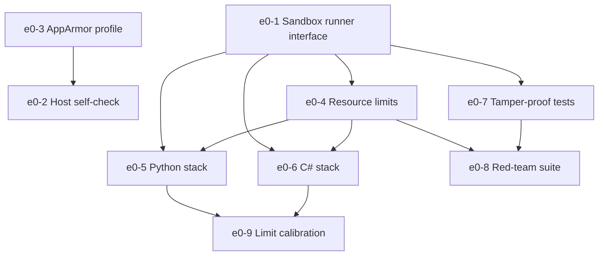

# Epic 0: The Crucible (Sandbox & Isolation)

## 1. Overview & Business Value
The Crucible is the execution foundation of EvoSwarm. It provides an unprivileged, airtight bubblewrap (`bwrap`) sandbox coupled with Linux cgroups v2 that executes untrusted, model-generated code candidates without network egress, without vulnerability to fork-bombs or memory exhaustion, and with absolute immunity to test tampering.

## 2. Exit Gate
> **Mandatory Exit Gate (Gate 0):**
> 100 baseline test runs completed across Python and C# stacks with **0 escapes**, network egress attempts and fork-bomb tests strictly contained, and resource limits calibrated against the host hardware.

## 3. Architectural Invariants
- Governed by **`AD-1` (Crucible Sandbox Isolation Boundary)**.
- Mount order invariant: `/work` tmpfs mounted first, followed by read-only bind mount of `/work/tests`.
- Strict network elimination: `--unshare-all`.
- Ephemeral lifecycle: per-candidate tmpfs directory deleted immediately on run conclusion.

## 4. Epic Stories Breakdown

| Story Key | Story Title | Priority | Sizing | Default Tier | Dependencies |
|---|---|---|---|---|---|
| `e0-1-sandbox-runner-interface` | Sandbox runner interface (`SandboxBackend` trait) | Must | M | `flash` | None |
| `e0-2-host-self-check` | Host isolation self-check (`evoswarm status`) | Must | S | `flash` | `e0-3-apparmor-profile-for-bwrap` |
| `e0-3-apparmor-profile-for-bwrap` | AppArmor profile for unprivileged bwrap | Must | S | `flash` | None |
| `e0-4-resource-limits` | Cgroups v2 memory, task, and wall-time limits | Must | M | `pro` | `e0-1-sandbox-runner-interface` |
| `e0-5-python-stack` | Python test runner profile (pytest, offline venv) | Must | M | `flash` | `e0-1-sandbox-runner-interface`, `e0-4-resource-limits` |
| `e0-6-csharp-stack` | C# test runner profile (dotnet test, Reqnroll/xUnit) | Must | L | `pro` | `e0-1-sandbox-runner-interface`, `e0-4-resource-limits` |
| `e0-7-tamper-proof-tests` | Read-only test mounts & harness tamper detection | Must | S | `pro` | `e0-1-sandbox-runner-interface` |
| `e0-8-red-team-suite` | Automated container escape and network egress suite | Must | M | `pro` | `e0-4-resource-limits`, `e0-7-tamper-proof-tests` |
| `e0-9-limit-calibration` | Machine limit calibration script | Should | S | `flash` | `e0-5-python-stack`, `e0-6-csharp-stack` |

## 5. Dependency Flow

