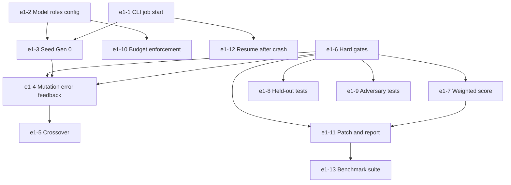

# Epic 1: Evolve CLI and Fitness (System 2 Engine)

## 1. Overview & Business Value
Epic 1 implements the core evolutionary optimization loop (**System 2**), multi-objective fitness evaluation, and the `evoswarm run` command-line interface. It takes a task description, file targets, and a test suite, iteratively breeds candidates using specialized model roles (`mutator`, `synthesiser`, `adversary`), executes them within the Crucible sandbox, and produces a verified git branch and patch file within strict token and dollar budgets.

## 2. Exit Gate
> **Mandatory Exit Gate (Gate 1 — Critical Decision Point):**
> EvoSwarm must achieve a **$\ge 15$ point higher solve rate** than single-shot code generation with test feedback on a fixed 30-task benchmark (at equal token budget). If it does not, the swarm search is halted in favor of a sandboxed test runner.

## 3. Architectural Invariants
- Governed by **`AD-5` (Strict Test Provenance & Gates)**, **`AD-6` (Model Role Segregation & Budget Invariants)**, and **`AD-7` (SQLite Job Ledger)**.
- Gating before scoring: (1) Clean build, (2) Visible trusted pass, (3) Zero tamper, (4) Zero skips.
- Final selection evaluated against held-out test slice (~20%).
- Crash recovery: all generations and idempotency keys stored in SQLite.

## 4. Epic Stories Breakdown

| Story Key | Story Title | Priority | Sizing | Default Tier | Dependencies |
|---|---|---|---|---|---|
| `e1-1-start-a-job-from-the-cli` | `evoswarm run` CLI job submission & validation | Must | M | `flash` | `e0-5-python-stack`, `e0-6-csharp-stack` |
| `e1-2-model-roles-in-config` | Multi-role model configuration & hot-reload | Must | S | `flash` | None |
| `e1-3-seed-the-first-generation` | Generation 0 population seeding & deduplication | Must | M | `flash` | `e1-1-start-a-job-from-the-cli`, `e1-2-model-roles-in-config` |
| `e1-4-mutation-with-error-feedback` | Compiler/test failure feedback mutation | Must | M | `pro` | `e1-3-seed-the-first-generation`, `e1-6-hard-gates` |
| `e1-5-crossover-of-two-parents` | 2-Parent crossover recombination engine | Should | M | `pro` | `e1-4-mutation-with-error-feedback` |
| `e1-6-hard-gates` | 4-Stage gating pipeline (build, pass, tamper, skip) | Must | M | `pro` | `e0-7-tamper-proof-tests` |
| `e1-7-weighted-score` | Multi-objective scoring function ($S = w_a A + w_p P + w_s Z$) | Must | S | `flash` | `e1-6-hard-gates` |
| `e1-8-held-out-tests` | 20% Held-out test split & winner verification | Must | M | `pro` | `e1-6-hard-gates` |
| `e1-9-adversary-tests` | Adversary red-team test generation & filtering | Should | M | `pro` | `e1-6-hard-gates` |
| `e1-10-budget-enforcement` | Token, dollar, and generation early-stop budget | Must | M | `flash` | `e1-2-model-roles-in-config` |
| `e1-11-patch-and-report` | Git branch creation, `.patch` emission, report | Must | M | `flash` | `e1-6-hard-gates`, `e1-7-weighted-score` |
| `e1-12-resume-after-crash` | SQLite job ledger generation resume & idempotency | Must | M | `pro` | `e1-1-start-a-job-from-the-cli` |
| `e1-13-benchmark-suite` | 30-Task benchmark runner & evaluation harness | Must | L | `pro` | `e1-11-patch-and-report` |

## 5. Dependency Flow

