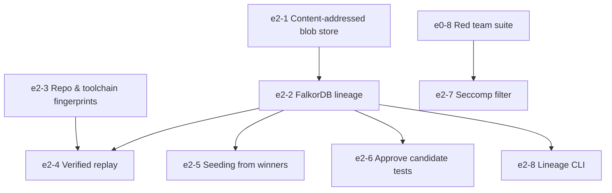

# Epic 2: System 1 Memory and Replay

## 1. Overview & Business Value
Epic 2 implements EvoSwarm's persistent organizational memory (**System 1**). By storing task lineage, evaluation metrics, and verified code implementations in FalkorDB and a content-addressed disk blob store, EvoSwarm avoids repeating work. A 3-point fingerprint (spec hash, repo fingerprint, toolchain fingerprint) enables sub-second re-verification of cached solutions with zero LLM expenditure.

## 2. Exit Gate
> **Mandatory Exit Gate (Gate 2):**
> Replay never serves a stale winner (0 test failures in current context), and vector-based seeding reduces tokens-per-solved-task on the benchmark suite by $\ge 30\%$.

## 3. Architectural Invariants
- Governed by **`AD-3` (Dual-Store Memory Architecture)** and **`AD-4` (Deterministic Replay Invalidation)**.
- Memory size invariant: FalkorDB stays under 1.5 GB RAM; heavy diffs and build logs reside in on-disk content-addressed blob storage.
- Safe reuse invariant: Fingerprints track touched paths, lockfiles, and toolchain versions.
- Sandbox gate for replay: Cached solutions must pass current tests in the Crucible before delivery.

## 4. Epic Stories Breakdown

| Story Key | Story Title | Priority | Sizing | Default Tier | Dependencies |
|---|---|---|---|---|---|
| `e2-1-content-addressed-blob-store` | Content-addressed disk store (`.evoswarm/blobs`) & GC | Must | M | `flash` | None |
| `e2-2-lineage-written-to-falkordb` | FalkorDB graph integration & Cypher lineage schema | Must | M | `pro` | `e2-1-content-addressed-blob-store`, `e1-11-patch-and-report` |
| `e2-3-repo-and-toolchain-fingerprints` | Invalidation fingerprints (path allowlist, lockfiles, SDKs) | Must | S | `flash` | None |
| `e2-4-verified-replay` | Sub-second replay engine with sandbox re-verification | Must | M | `pro` | `e2-2-lineage-written-to-falkordb`, `e2-3-repo-and-toolchain-fingerprints` |
| `e2-5-seeding-from-similar-winners` | Vector similarity search & Gen 0 winner seeding | Should | M | `pro` | `e2-2-lineage-written-to-falkordb` |
| `e2-6-approve-candidate-tests` | `evoswarm approve-tests` CLI triage promotion | Should | S | `flash` | `e1-9-adversary-tests`, `e2-2-lineage-written-to-falkordb` |
| `e2-7-seccomp-filter` | Extended seccomp BPF syscall filter in Crucible | Should | M | `pro` | `e0-8-red-team-suite` |
| `e2-8-lineage-cli` | `evoswarm lineage` CLI inspection & JSON export | Could | S | `flash` | `e2-2-lineage-written-to-falkordb` |

## 5. Dependency Flow

