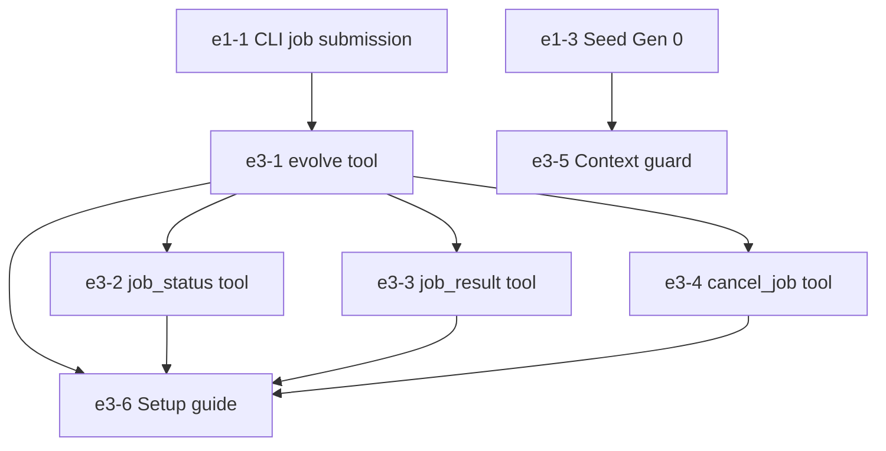

# Epic 3: Claude Code Integration (MCP Server)

## 1. Overview & Business Value
Epic 3 bridges EvoSwarm directly into the developer's everyday interactive session via the Model Context Protocol (MCP). Claude Code delegates complex, test-backed engineering challenges to EvoSwarm asynchronously without context pollution or blocking interactive pair-programming.

## 2. Exit Gate
> **Mandatory Exit Gate (Gate 3):**
> An end-to-end task issued from a Claude Code session via the `evolve` MCP tool completes in the background, returns a patch and lineage report via `job_result`, which the agent applies and verifies locally with 0 manual intervention.

## 3. Architectural Invariants
- Governed by **`AD-2` (Decoupled Frontends & Asynchrony)** and **`AD-7` (SQLite Job Ledger)**.
- Fast return: Tool calls return job tickets within $< 2$ seconds.
- Context guard: Secrets scanning and path allowlists prevent local repository keys or `.env` files from leaking into prompts.

## 4. Epic Stories Breakdown

| Story Key | Story Title | Priority | Sizing | Default Tier | Dependencies |
|---|---|---|---|---|---|
| `e3-1-evolve-tool` | `evolve` MCP tool implementation (ticket submission) | Must | M | `flash` | `e1-1-start-a-job-from-the-cli` |
| `e3-2-job-status-tool` | `job_status` MCP polling tool (ETA, cost, score) | Must | S | `flash` | `e3-1-evolve-tool` |
| `e3-3-job-result-tool` | `job_result` MCP retrieval tool (patch, diff, report) | Must | S | `flash` | `e3-1-evolve-tool`, `e1-11-patch-and-report` |
| `e3-4-cancel-job-tool` | `cancel_job` MCP cancellation tool | Must | S | `flash` | `e3-1-evolve-tool` |
| `e3-5-context-guard` | Path allowlist & secret redaction context filter | Must | M | `pro` | `e1-3-seed-the-first-generation` |
| `e3-6-setup-guide` | 15-minute quickstart guide & MCP configuration | Should | S | `flash` | `e3-1-evolve-tool` to `e3-4-cancel-job-tool` |

## 5. Dependency Flow

