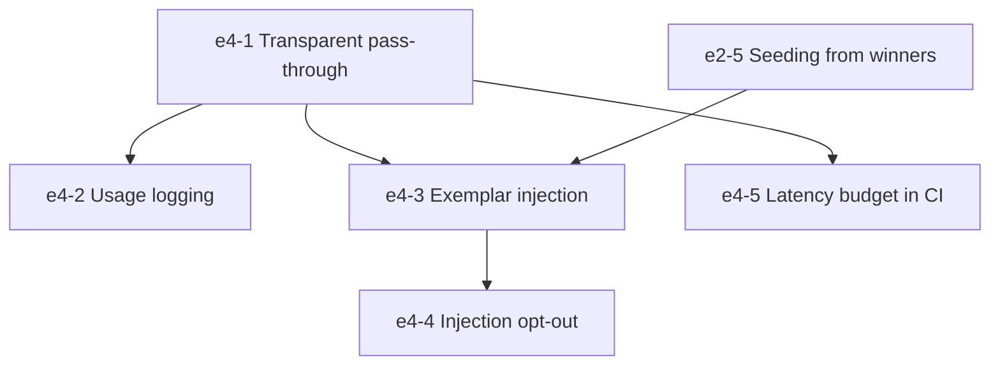

# Epic 4: Optional Streaming Gateway

## 1. Overview & Business Value
Epic 4 introduces a lightweight, zero-latency streaming reverse proxy built on Tokio and Axum that intercepts Claude Code traffic directed at `ANTHROPIC_BASE_URL`. It provides local token and spend auditing and enriches user prompts with verified past implementations (exemplars) without delaying time-to-first-token.

## 2. Exit Gate
> **Mandatory Exit Gate (Gate 4):**
> Reverse proxy adds **$< 50$ ms time-to-first-token (TTFT)** at p95 under 20 concurrent streams, passes Server-Sent Events (SSE) byte-for-byte, and preserves all `tool_use` and `thinking` blocks.

## 3. Architectural Invariants
- Governed by **`AD-2` (Decoupled Gateway and Swarm Asynchrony)**.
- Strictly non-blocking: Exemplar memory retrieval has a hard 20 ms timeout; times out seamlessly to transparent passthrough.
- Zero mutation of SSE payloads: Byte-for-byte fidelity with upstream model provider.

## 4. Epic Stories Breakdown

| Story Key | Story Title | Priority | Sizing | Default Tier | Dependencies |
|---|---|---|---|---|---|
| `e4-1-transparent-pass-through` | High-throughput Axum/Tokio SSE reverse proxy | Should | L | `pro` | None |
| `e4-2-usage-logging` | Local token count & cost accounting (`evoswarm usage`) | Should | S | `flash` | `e4-1-transparent-pass-through` |
| `e4-3-exemplar-injection` | 20ms Bounded memory exemplar prompt injection | Could | M | `pro` | `e2-5-seeding-from-similar-winners`, `e4-1-transparent-pass-through` |
| `e4-4-injection-opt-out` | Header `x-evoswarm-inject: off` & config bypass | Should | S | `flash` | `e4-3-exemplar-injection` |
| `e4-5-latency-budget-in-ci` | Automated 20-stream latency benchmark gate in CI | Should | M | `flash` | `e4-1-transparent-pass-through` |

## 5. Dependency Flow

