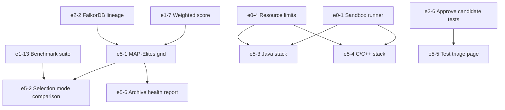

# Epic 5: MAP-Elites and Multi-Stack Expansion

## 1. Overview & Business Value
Epic 5 elevates EvoSwarm's search algorithm from a standard Top-K population archive to an illumination-based MAP-Elites grid ($4 \times 4$), maintaining phenotypic diversity along runtime and patch-size dimensions. It also expands Crucible language capabilities to enterprise Java (Maven / JUnit / Cucumber) and native C / C++ (CMake / GoogleTest / Catch2), coupled with a lightweight web UI for adversary test triage.

## 2. Exit Gate
> **Mandatory Exit Gate (Gate 5):**
> MAP-Elites matches or outperforms Top-K solve rate on the 30-task benchmark while preserving higher candidate diversity; Java and C/C++ sandboxes achieve 100% containment on the red-team suite.

## 3. Architectural Invariants
- Governed by **`AD-1` (Crucible Sandbox)** and **`AD-8` (MAP-Elites Archive for Phenotypic Diversity)**.
- Phenotypic coordinates: Runtime relative to baseline (4 bins) $\times$ diff size (4 bins).
- Web UI safety: Binds strictly to `127.0.0.1` for local operator inspection only.

## 4. Epic Stories Breakdown

| Story Key | Story Title | Priority | Sizing | Default Tier | Dependencies |
|---|---|---|---|---|---|
| `e5-1-map-elites-grid` | $4 \times 4$ Phenotypic archive grid implementation | Could | M | `pro` | `e1-7-weighted-score`, `e2-2-lineage-written-to-falkordb` |
| `e5-2-selection-mode-comparison` | Benchmark harness comparison: MAP-Elites vs Top-K | Could | S | `flash` | `e5-1-map-elites-grid`, `e1-13-benchmark-suite` |
| `e5-3-java-stack` | Java sandbox runner profile (Maven, JUnit, Cucumber) | Could | L | `pro` | `e0-1-sandbox-runner-interface`, `e0-4-resource-limits` |
| `e5-4-c-and-cpp-stack` | C / C++ sandbox runner profile (CMake, GoogleTest, Catch2) | Could | M | `pro` | `e0-1-sandbox-runner-interface`, `e0-4-resource-limits` |
| `e5-5-test-triage-page` | Local web GUI for adversary test review & triage | Could | M | `flash` | `e2-6-approve-candidate-tests` |
| `e5-6-archive-health-report` | Visual archive diversity & cell occupancy report | Could | S | `flash` | `e5-1-map-elites-grid` |

## 5. Dependency Flow

