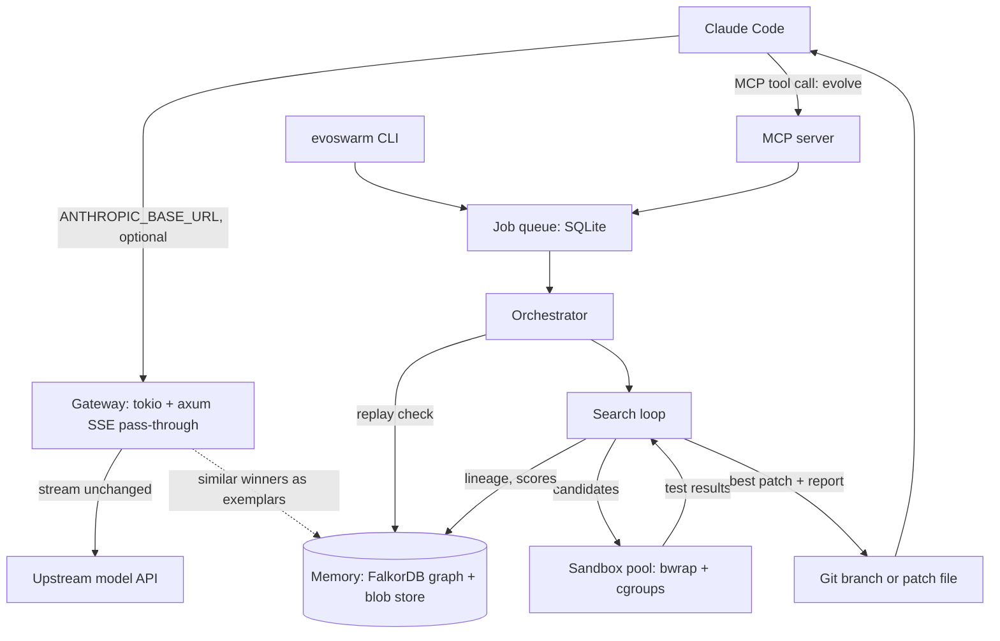
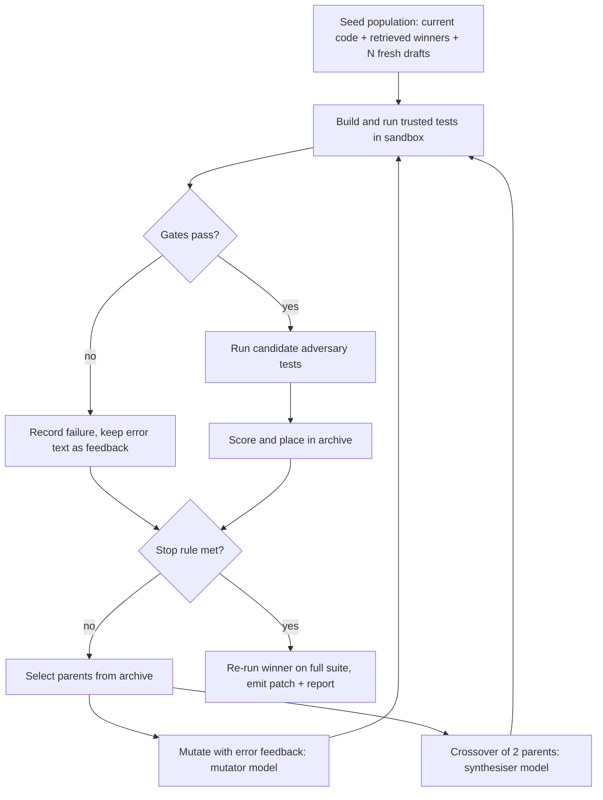
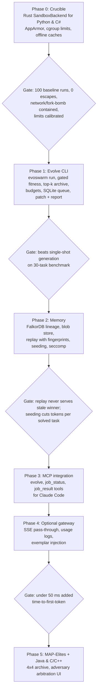

# EvoSwarm: Evolutionary Code Swarm PRD

## Executive Summary

EvoSwarm is a self-hosted Rust service that evolves code against a test suite and remembers what worked. Claude Code hands it a task through an MCP tool or the CLI; a budgeted evolutionary loop (System 2) breeds candidates with Claude models, scores them in bubblewrap sandboxes (the Crucible), and returns the best passing patch with its lineage and evidence.

A FalkorDB graph memory (System 1) stores every winner, its lineage and the attacks it survived. Repeat tasks replay a verified winner in seconds, and similar tasks start from proven seeds, so model spend falls as the memory grows. An optional streaming gateway in front of the model API adds usage logging and exemplar injection without adding latency.

EvoSwarm targets a single headless Linux box, including repurposed 2012-era hardware, with no VMs or container daemons.

## Product Definition

**Primary user:** a solo developer or small team running Claude Code against their own repos, on one Linux box they control.

### Goals

- Turn a failing or missing implementation into a passing one for tasks with a crisp evaluator: algorithms, parsers, data transforms, bug fixes with a repro test, performance tuning against a benchmark.
- Never run untrusted code outside a sandbox with no network, bounded memory, bounded processes and a hard timeout.
- Make every result auditable: which tests it passed, which model produced it, what it was derived from.
- Reduce repeat LLM spend by reusing prior winning implementations as seeds and exemplars.

### Non-Goals

- Answering IDE autocomplete or chat requests inline.
- Serving cached code to a client without re-running its tests in the current context.
- Tasks with no executable evaluator (UI polish, open-ended refactors, architecture advice).
- Trading strategy search and tick-data backtesting.
- Multi-tenant or remote untrusted users.

### Operating Modes

| Mode | Trigger | Latency Target | What It Does |
| --- | --- | --- | --- |
| **Gateway (optional)** | Client points its base URL at EvoSwarm | Adds under 50 ms to time-to-first-token | Streams through to the upstream API unchanged; logs usage; optionally injects retrieved exemplars into the system prompt |
| **Evolve job** | `evolve` MCP tool call from Claude Code, or `evoswarm run` CLI | Minutes; reports progress | Runs the search loop against the task's tests and returns a patch, score and report |
| **Replay** | Same spec hash, repo fingerprint and toolchain fingerprint as a stored winner | Seconds | Re-runs the stored winner's tests in a sandbox and returns it only if it still passes |

## Architecture

The request path and the search path are separate: the gateway never waits on the swarm, and the swarm only starts from an explicit job with tests attached.



### Components

- **Gateway (optional):** A streaming reverse proxy that passes SSE through byte-for-byte, records token usage, and can prepend up to 2 retrieved exemplars to the system prompt. It never blocks on anything slower than a memory lookup with a 20 ms timeout.
- **MCP server:** Exposes `evolve(task, test_command, paths, budget)`, `job_status(id)` and `job_result(id)`. Claude Code calls it like any other tool and polls for the result.
- **Job queue:** SQLite with one row per job, so a crash or reboot resumes cleanly.
- **Orchestrator:** Checks replay first, then seeds a population from retrieved winners and the current code, and enforces the job's token, dollar and wall-clock budget.
- **Sandbox pool:** A fixed number of bwrap workers sized to the hardware (see Capacity).
- **Memory:** FalkorDB for lineage and lookup, plus a content-addressed blob store for code and logs.

### Search Loop



The stop rule fires on the first of: target score reached, budget spent, or no score improvement across 2 generations. Failed candidates are kept as feedback, because the compiler and test output is the most useful input the next mutation gets.

## Fitness, Test Provenance, and MAP-Elites

Fitness is a set of hard gates followed by a weighted score, and only tests a human wrote or approved can gate a candidate.

### Test Provenance

| Source | Status | Can Gate? | Shown to Mutators? |
| --- | --- | --- | --- |
| User's existing suite | Trusted | Yes | Yes |
| Held-out slice of user suite (~20%) | Trusted, hidden | Final selection only | No |
| Adversary-written tests | Candidate | No; scored at low weight | Yes |
| Candidate tests approved by human in report | Promoted to trusted for future jobs | Yes, next job | Yes |

### Gates (fail any one and score is 0)

1. The candidate builds with no new compiler errors.
2. Every visible trusted test passes.
3. The diff touches no test files, harness files or build scripts; the tests run from a read-only mount so edits there have no effect anyway.
4. No test is skipped, ignored or deleted relative to the baseline run.

### Scoring Function

For a candidate that passes the gates, the weighted score $S$ is calculated as:

$$S = w_a \cdot A + w_p \cdot P + w_s \cdot Z, \quad w_a = 0.5,\; w_p = 0.3,\; w_s = 0.2$$

Where:
- $A$: Pass rate on candidate adversary tests $[0, 1]$.
- $P$: Runtime relative to baseline, clamped to $[0, 1]$.
- $Z$: Size score rewarding smaller diffs $[0, 1]$.

The overall winner is the highest-$S$ candidate that also passes the hidden held-out slice.

### MAP-Elites Archive

The archive is a $4 \times 4$ grid:
- Axis 1: Runtime versus baseline (4 bins).
- Axis 2: Diff size in changed lines (4 bins).

Each cell keeps its best-scoring candidate, and parents are drawn evenly across occupied cells so the search does not collapse onto one approach. *(Deferred to Phase 5; until then, the archive operates as a top-k list).*

## Sandbox (The Crucible)

Each candidate runs in a fresh `bwrap` namespace with no network, a read-only toolchain, a pre-restored dependency cache, and cgroup limits on memory and process count. Limits below are starting values; Phase 0 calibrates them against a baseline run on the target box.

| Stack | Harness | Read-only Mounts | Offline Dependency Cache | Wall Limit | Memory Limit | tmpfs Limit |
| --- | --- | --- | --- | --- | --- | --- |
| **Python** | pytest | `/usr`, prebuilt venv | venv `site-packages` | 30 s | 512 MB | 256 MB |
| **C / C++** | GoogleTest or Catch2 via CMake | `/usr` | prebuilt test libs | 60 s | 1 GB | 512 MB |
| **C#** | dotnet test, xUnit or Reqnroll | `/usr` (includes `/usr/share/dotnet`) | NuGet packages folder, restore run once outside sandbox | 120 s | 2 GB | 1 GB |
| **Java** | JUnit or Cucumber via Maven offline | `/usr/lib/jvm`, `/etc/alternatives` | `~/.m2` repository snapshot | 120 s | 2 GB | 1 GB |

*Note: C# BDD specs use Reqnroll, the maintained successor to SpecFlow.*

### Baseline Invocation

The Rust `SandboxBackend` builds this per stack:

```bash
# bwrap applies mounts in order: /work first, then the read-only tests on top of it
systemd-run --user --scope -q \
  -p MemoryMax=2G -p TasksMax=256 -p CPUQuota=100% \
  timeout --kill-after=5s 120s \
  bwrap --unshare-all --die-with-parent --new-session --clearenv \
    --ro-bind /usr /usr \
    --symlink usr/bin /bin --symlink usr/lib /lib --symlink usr/lib64 /lib64 \
    --proc /proc --dev /dev --tmpfs /tmp \
    --ro-bind "$CACHE" /cache \
    --bind "$WORKDIR" /work \
    --ro-bind "$TESTS" /work/tests \
    --setenv HOME /work --setenv NUGET_PACKAGES /cache/nuget \
    --chdir /work \
    dotnet test --no-restore
```

### Host Setup Requirements

- **Unprivileged user namespaces:** Required for `bwrap`. Ubuntu releases may restrict them via AppArmor; ship a profile for the bwrap binary and add a Phase 0 check that fails loudly if namespaces cannot be created.
- **Service user lingering:** Enable with `loginctl enable-linger` so `systemd-run --user` works headlessly and enforces cgroup v2 memory limits.
- **tmpfs work directory:** Mount per-candidate `$WORKDIR` on a host tmpfs sized to the stack's limit; delete when run concludes.
- **Seccomp filter:** In Phase 2, block syscalls such as `ptrace`, `mount`, `keyctl`, `bpf`, `perf_event_open`, and `unshare`.

## Graph Schema

Lineage, scores, and lookup keys live in FalkorDB; code, logs, and test output live in a content-addressed blob store on disk, referenced by SHA-256. This keeps FalkorDB small enough to fit in RAM on an older box.

### Nodes

| Label | Key Properties |
| --- | --- |
| `Task` | `task_id`, `spec_hash`, `repo_fingerprint`, `toolchain_fingerprint`, `stack`, `created_at` |
| `Implementation` | `impl_id`, `blob_sha256`, `generation`, `model_id`, `prompt_hash`, `diff_lines` |
| `Evaluation` | `eval_id`, `gates_passed`, `score`, `runtime_ms`, `peak_mem_mb`, `sandbox_profile`, `log_sha256` |
| `TestCase` | `test_id`, `blob_sha256`, `source` (user, adversary), `status` (trusted, candidate, rejected) |
| `Vulnerability` | `vuln_id`, `attack_vector`, `description` |
| `Cell` | `stack`, `runtime_bin`, `size_bin` *(Phase 5)* |

### Relationships

- `(Task)-[:HAS_CANDIDATE]->(Implementation)`
- `(Task)-[:WON_BY]->(Implementation)`
- `(Implementation)-[:MUTATED_FROM]->(Implementation)`
- `(Implementation)-[:MERGED_FROM {traits}]->(Implementation)`
- `(Implementation)-[:EVALUATED_AS]->(Evaluation)`
- `(Evaluation)-[:RAN {result}]->(TestCase)`
- `(TestCase)-[:EXPOSED]->(Vulnerability)`
- `(Implementation)-[:OCCUPIES]->(Cell)` *(Phase 5)*

### Invalidation & Replay Keys

- `repo_fingerprint`: Hashed content of touched files plus the lockfile; any dependency bump invalidates replay.
- `toolchain_fingerprint`: Hashed compiler, runtime, and test runner versions; an SDK upgrade invalidates replay.
- Vector index on task description embeddings finds similar past tasks for seeding; matches serve only as seeds or exemplars, never unverified returned answers.

## Capacity, Cost, and Latency on 2012 Hardware

Target box: Quad-core 8-thread CPU, 16 GB RAM, SSD.
Concurrency is RAM-bound at ~3 C#/Java workers or ~6 Python workers. Default C# jobs take 8–10 minutes; Python jobs are model-latency bound.

### RAM Budget (16 GB)

| Consumer | Reserved RAM |
| --- | --- |
| OS, systemd, SSH | 2.0 GB |
| FalkorDB (metadata only) | 1.5 GB |
| Orchestrator, Gateway, MCP Server | 0.5 GB |
| Host tmpfs work directories | 1.0 GB |
| Sandbox workers pool | ~11.0 GB |

### Default Job Budget

| Parameter | Default | Effect |
| --- | --- | --- |
| Population per generation | 6 | Candidates drafted per round |
| Max generations | 4 | At most 24 sandbox runs + 1 final run |
| Early stop | No score improvement over 2 generations | Saves ~33% of runs on straightforward tasks |
| Workers (C# / Java) | 3 | 24 runs @ 60s ≈ 8 minutes |
| Workers (Python) | 6 | Sandbox time < 1 min; model calls dominate |
| Token cap per job | 600k input, 100k output | Hard stop; returns best verified partial result |
| Dollar cap per job | Configured by user | Evaluated before every model dispatch |

*If operating on 8 GB RAM: Run 1 C# worker or 3 Python workers; C# jobs will take approximately 3x longer.*

## Roadmap

Build the evaluator before the swarm: each phase ships a standalone capability with a mandatory exit gate. Python and C# lead; Java and C/C++ follow.



## Metrics, Risks, and Open Questions

### Success Metrics

| Metric | Target |
| --- | --- |
| Solve rate on internal benchmark vs single-shot with test feedback | $\ge$ 15 points higher |
| Sandbox escapes or network egress in red-team suite | Exactly 0 |
| Stale replay served (winner fails tests in current context) | Exactly 0 |
| Tokens per solved task (month 3 vs month 1) | 30% reduction via seeding and replay |
| Gateway added time-to-first-token | $< 50$ ms at p95 |
| Patches accepted by user without edits | Tracked as primary customer quality metric |

### Risk Matrix

| Risk | Likelihood | Mitigation |
| --- | --- | --- |
| Evolution gives no gain over one good attempt | Medium | Phase 1 benchmark gate; fallback to sandboxed test runner |
| Candidates game the evaluator | High | Read-only tests, diff check on tests/harness, hidden held-out slice |
| Adversary tests encode wrong expectations | Medium | Adversary tests never gate; human reviews and promotes them |
| Token spend runs away | Medium | Per-job token and dollar caps evaluated before every model call |
| Old CPU makes C#/Java jobs too slow | Medium | Python-first; measure in Phase 0; scale concurrency to RAM |
| Kernel/AppArmor update breaks bwrap | Low-Med | Phase 0 self-check runs on startup and blocks jobs on failure |
| Repo secrets leak into prompts or logs | Medium | Path allowlist per job; regex scanner on context; local logs |

### Open Questions

- [ ] What are the actual CPU, RAM, and disk specs of the target deployment box?
- [ ] Which 30 tasks form the Phase 1 benchmark, and do all have trusted tests?
- [ ] Is GitHub Copilot a target client, or strictly Claude Code?
- [ ] Should a winning patch land as a git branch, a patch file, or both? *(Decided: both)*
- [ ] What monthly spend cap applies across all jobs?
